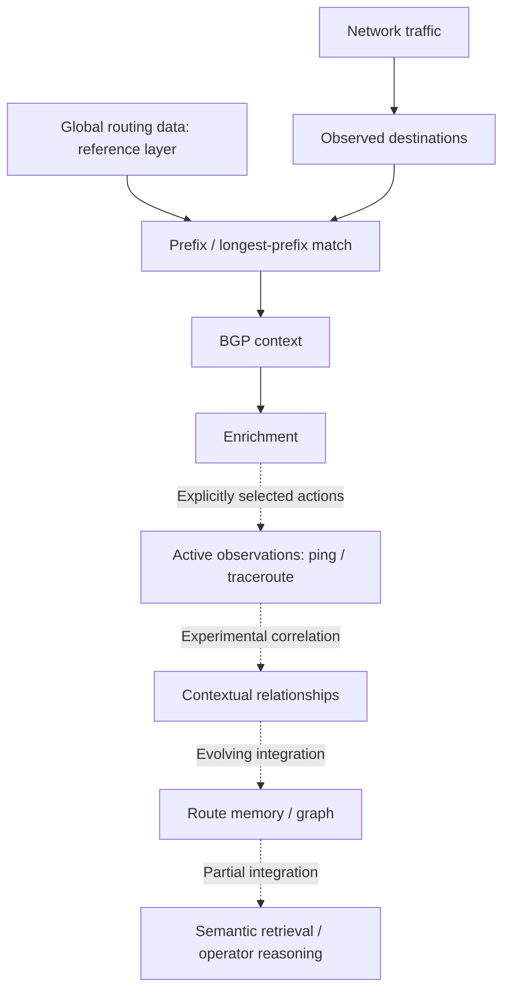

[Português (Brasil)](README.md) | [English](README.en.md)

# RouteBrain

**Demand-driven network intelligence and routing observability prototype.**

RouteBrain explores how to turn network observations into context and memory so an operator can investigate paths and changes over time. Its focus is **the Internet relevant to a network, observed from that network**: global routing data provides a reference layer; destinations actually used by the network define where deeper investigation is useful.

The first experiment processed more than one million real BGP records from RouteViews, demonstrating ingestion, persistence and reconstruction at that scale.

This is an experimental implementation and engineering archive, not a production-ready service. Source comments and some interfaces remain in Portuguese.

## The problem

Operators can observe current network state, but contextual and temporal questions are harder:

- How was this destination reached before?
- Which paths and elements have appeared in its observations?
- What changed between two observations?
- Which parts of the Internet matter to this network?

These questions motivate the architecture. They are not a claim that every question is already answered end to end.

## What RouteBrain is trying to answer

RouteBrain aims to turn observations into context and memory: how a route was reached, where it passed, what changed, and which earlier operator actions were associated with those changes.

- How was this destination reached a week ago?
- What changed between two observations?
- Have we seen this network element or path before?
- Which parts of the Internet actually matter to this operator?
- What historical evidence should an operator inspect before changing BGP policy or communities?

These range from existing building blocks to architectural targets. See [docs/OPERATOR_QUESTIONS.md](docs/OPERATOR_QUESTIONS.md) for capability boundaries.

## The first approach

The first experiment ingested a real global RouteViews RIB and processed more than one million BGP records. It demonstrated ingestion, persistence and reconstruction at that scale.

The engineering lesson was that **global ingestion and deep global semantic materialization are different scaling problems**. Contextualizing every prefix, path, hop and observation exceeded the practical scope of the available hardware. This is the project's architectural motivation, not a benchmark proving a universal hardware limit.

## The architectural pivot

**Demand-driven semantic materialization** selects a working set: destinations actually observed in operator traffic become candidates for deeper context, enrichment and measurements.

The global RIB remains a reference. The intended deep materialization layer grows selectively around operator-relevant destinations, rather than attempting to understand the whole Internet equally.

Code already exists for observed destinations, LPM, enrichment, baseline promotion, measurements and operational memory. Collection, enrichment, promotion and measurement remain separate operations with explicit controls. The full automatic traffic-to-graph-to-learning loop is **not complete**.

## Implementation status

| Category | What is represented here |
|---|---|
| **Implemented** | MRT parsing, PostgreSQL raw/current representation, LPM queries, observed-destination collection/persistence, enrichment interfaces, ping/traceroute parsing and storage, FastAPI and CLI interfaces |
| **Experimental** | Destination baselines, contextual route reports, route memory and hop facts, graph exports/viewers, semantic documents and embeddings, assisted operator queries, browser laboratories, offline worker bootstrap |
| **Architectural direction** | Automatic demand-driven materialization across the full pipeline, context-based entity resolution independent of IP, comprehensive temporal queries and generation-aware invalidation of derived knowledge |

“Implemented” means code and historical execution evidence exist. It does not imply production readiness or integration-test coverage of every subsystem in this public export.

## Contextual identity

**An IP address is evidence, not necessarily an identity.** Private addresses may be reused; the same address can mean different things at different vantage points.

Context can include predecessor, successor, adjacency, ASN, vantage point, path, timestamp, recurrence and related observations. Existing route/segment matching and graph structures are steps toward that model. Complete entity resolution and durable contextual identities independent of individual addresses remain architectural work.

## Temporal operational memory

Persisted measurements, route observations, hop facts and graph snapshots provide a foundation for remembering what was observed. A traceroute is an observation from a particular origin, not a universal topology map. Historical persistence is implemented experimentally; arbitrary point-in-time reconstruction and comprehensive change diagnosis are not complete.

## Architecture



The diagram shows the intended composition. Dashed links are not a claim of a completed autonomous pipeline. **Global routing data = reference layer. Observed/operator-relevant Internet = deep materialization layer.**

Python, FastAPI, PostgreSQL, RouteViews/MRT, LPM, active measurements, enrichment, route memory, graphs, semantic retrieval, Grafana and CLI form the existing component set. See [ARCHITECTURE.md](ARCHITECTURE.md) for code pointers and boundaries.

## Engineering case study: the CIDR incident

An early parser projection retained the network address but lost its prefix length. PostgreSQL received bare IPv4 addresses and represented them as `/32`. Preserved `raw_record` data made recovery possible.

A read-only audit on 2026-09-15 verified the recovered private dataset:

| Evidence | Count |
|---|---:|
| Raw records | 1,061,466 |
| Current route rows | 1,061,196 |
| Distinct current prefixes | 1,061,192 |
| Legitimate `/32` rows in each recovered table | 84 |
| Raw CIDR mismatches against original prefix + length | 0 |

These are historical audit measurements, **not data included in this repository or a benchmark reproduced by the public tests**. The normalized parser selects the first RIB entry; the figures do not imply all alternatives from every peer are materialized.

The old change table contains bootstrap materialization and false comparisons caused by prefix collisions. **It does not demonstrate more than one million observed BGP changes.** Derived summaries, caches and semantic context also require reconciliation. The public code preserves that experimental debt; this export did not repair the operational system. Read the [sanitized postmortem](docs/CIDR32_POSTMORTEM.md).

## Explore safely

**Brazilian Portuguese is the canonical language of the main documentation.** This README is the complete secondary English translation. Architecture, operator questions, engineering history, the CIDR postmortem and roadmap are currently available in Portuguese. Validation and public-export reports remain in English.

**Public release validation.** The isolated public suite reports **79 passed / 0 failed**, with syntax, API import and operational-reference checks passing. Seven preexisting offline-fixture failures remain in the original source baseline; their public counterparts already have isolated fixtures. See [VALIDATION.md](docs/VALIDATION.md) for the independence evidence, bounded patches and integration-test limitations.

Start with the [architecture](ARCHITECTURE.md), [engineering history](docs/ENGINEERING_HISTORY.md), [roadmap](docs/ROADMAP.md) and [public export boundaries](docs/PUBLIC_EXPORT.md).

For an offline code demonstration, use a fresh local environment:

```sh
python -m venv .venv
. .venv/bin/activate
python -m pip install -r requirements.txt -r requirements-dev.txt
python scripts/offline_check.py
```

Dependency installation needs package access; the check itself denies network connections, subprocess execution and database connections. It syntax-checks Python, imports the API without starting it, and runs isolated unit/contract tests with fake persistence where needed. It does not ingest data, migrate a database, issue measurements, call an LLM or load model weights.

Database schemas under `sql/` are historical building blocks, **not a validated one-command migration sequence**. The API includes write-capable operator actions and is not entirely read-only. Do not expose it publicly or run ingestion/measurement scripts against an existing deployment without reviewing their behavior and configuring an isolated database.

No operational `.env`, credentials, datasets, HARs, database dumps, deployment secrets or original Git history are included. No `.env.example` was copied. Required configuration names and optional dependencies are documented in [PUBLIC_EXPORT.md](docs/PUBLIC_EXPORT.md).

## License

**LICENSE_DECISION=PENDING.** No project license has been selected for this first public version. Dependency licenses do not license RouteBrain itself. Third-party datasets, model weights and externally loaded visualization libraries have their own terms.
