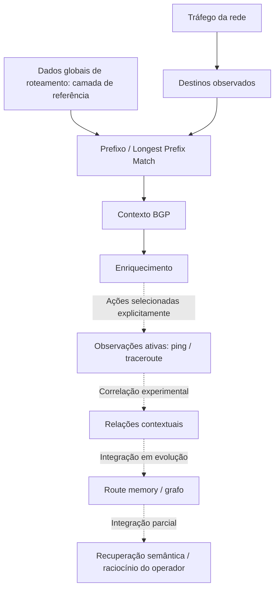

[Português (Brasil)](README.md) | [English](README.en.md)

[](https://github.com/escossio/routebrain/actions/workflows/quality.yml)
[](https://github.com/escossio/routebrain/actions/workflows/codeql.yml)

# RouteBrain

**Protótipo de inteligência e observabilidade de redes orientadas pelo uso.**

O RouteBrain explora como transformar observações de rede em contexto e memória para que o operador investigue caminhos e mudanças ao longo do tempo. Seu foco é **a Internet relevante para uma rede, observada a partir dessa rede**: dados globais de roteamento fornecem a referência; os destinos realmente utilizados definem onde vale aprofundar a investigação.

O primeiro experimento processou mais de um milhão de registros BGP reais do RouteViews, demonstrando ingestão, persistência e reconstrução nessa escala.

Este é um projeto experimental e um registro de engenharia, não um serviço pronto para produção. Comentários de código e algumas interfaces permanecem em português.

## O problema

Operadores conseguem observar o estado atual da rede, mas perguntas contextuais e temporais são mais difíceis:

- Como esse destino era alcançado antes?
- Quais caminhos e elementos apareceram nas observações desse destino?
- O que mudou entre duas observações?
- Quais partes da Internet importam para esta rede?

Essas perguntas motivam a arquitetura. Não significam que todas já sejam respondidas end-to-end.

## Que perguntas o RouteBrain pretende responder?

O RouteBrain pretende transformar observações em contexto e memória: como uma rota era alcançada, por onde passou, o que mudou e quais ações anteriores do operador estiveram associadas a essas mudanças.

- Como esse destino era alcançado uma semana atrás?
- O que mudou entre duas observações?
- Já vimos esse elemento de rede ou caminho antes?
- Quais partes da Internet realmente importam para este operador?
- Que evidências históricas o operador deve analisar antes de alterar uma política BGP ou communities?

Essas perguntas vão de componentes existentes a objetivos arquiteturais. Veja [docs/OPERATOR_QUESTIONS.md](docs/OPERATOR_QUESTIONS.md) para conhecer os limites de capacidade.

## A primeira abordagem

O primeiro experimento ingeriu uma RIB global real do RouteViews e processou mais de um milhão de registros BGP. Demonstrou ingestão, persistência e reconstrução nessa escala.

A lição de engenharia foi que **ingestão global e materialização semântica profunda global são problemas de escala diferentes**. Contextualizar cada prefixo, caminho, hop e observação excedeu o escopo prático do hardware disponível. Essa é a motivação arquitetural do projeto, não um benchmark que comprove um limite universal de hardware.

## O pivô arquitetural

A **materialização semântica orientada pelo uso** seleciona um working set: destinos efetivamente observados no tráfego do operador tornam-se candidatos a contexto mais profundo, enriquecimento e medições.

A RIB global permanece como referência. A camada profunda pretendida cresce seletivamente ao redor dos destinos relevantes ao operador, em vez de tentar compreender toda a Internet com a mesma profundidade.

Já existe código para observed destinations, LPM, enriquecimento, promoção de baseline, medições e memória operacional. Coleta, enriquecimento, promoção e medição continuam sendo operações separadas com controles explícitos. O ciclo automático completo de tráfego, grafo e aprendizado **não está concluído**.

## Estado da implementação

| Categoria | O que está representado aqui |
|---|---|
| **IMPLEMENTADO** | Parsing MRT, representação raw/current em PostgreSQL, consultas LPM, coleta/persistência de observed destinations, interfaces de enriquecimento, parsing e armazenamento de ping/traceroute, interfaces FastAPI e CLI |
| **EXPERIMENTAL** | Baselines de destinos, relatórios contextuais de rotas, route memory e fatos de hops, exportação/visualização de grafos, documentos semânticos e embeddings, consultas assistidas ao operador, laboratórios de navegador e bootstrap com worker offline |
| **DIREÇÃO ARQUITETURAL** | Materialização automática orientada pelo uso em todo o pipeline, entity resolution contextual independente de IP, consultas temporais abrangentes e invalidação de conhecimento derivado por geração |

“Implementado” significa que existem código e evidência histórica de execução. Não implica prontidão para produção nem cobertura de testes de integração de todos os subsistemas deste export público.

## Identidade contextual

**Um endereço IP é evidência, não necessariamente uma identidade.** Endereços privados podem ser reutilizados; o mesmo endereço pode ter significados diferentes em pontos de observação distintos.

O contexto pode incluir predecessor, sucessor, adjacência, ASN, vantage point, caminho, timestamp, recorrência e observações relacionadas. Correspondência de rotas/segmentos e estruturas de grafos existentes são passos nessa direção. Entity resolution completa e identidades contextuais duráveis, independentes de endereços individuais, continuam como trabalho arquitetural.

## Memória operacional temporal

Medições persistidas, observações de rotas, fatos de hops e snapshots de grafos fornecem uma base para lembrar o que foi observado. Um traceroute é uma observação a partir de uma origem específica, não um mapa universal da topologia. A persistência histórica está implementada experimentalmente; reconstrução em um instante arbitrário e diagnóstico abrangente de mudanças não estão concluídos.

## Arquitetura



O diagrama mostra a composição pretendida. Ligações tracejadas não representam um pipeline autônomo concluído. **Dados globais de roteamento = camada de referência. Internet observada/relevante ao operador = camada de materialização profunda.**

Python, FastAPI, PostgreSQL, RouteViews/MRT, LPM, medições ativas, enriquecimento, route memory, grafos, recuperação semântica, Grafana e CLI formam o conjunto de componentes existentes. Veja [ARCHITECTURE.md](ARCHITECTURE.md) para referências ao código e fronteiras.

## Caso de engenharia: o incidente CIDR

Uma projeção inicial do parser preservava o endereço de rede, mas perdia o comprimento do prefixo. O PostgreSQL recebia endereços IPv4 isolados e os representava como `/32`. Os dados preservados em `raw_record` permitiram a recuperação.

Uma auditoria somente de leitura, realizada em 2026-09-15, verificou o dataset privado recuperado:

| Evidência | Quantidade |
|---|---:|
| Registros raw | 1.061.466 |
| Rotas correntes | 1.061.196 |
| Prefixos correntes distintos | 1.061.192 |
| Registros `/32` legítimos em cada tabela recuperada | 84 |
| Divergências de CIDR raw contra prefixo + comprimento original | 0 |

Essas são medições históricas de auditoria, **não dados incluídos no repositório nem um benchmark reproduzido pelos testes públicos**. O parser normalizado seleciona a primeira entrada da RIB; os números não significam que todas as alternativas de todos os peers foram materializadas.

A tabela antiga de mudanças contém materialização inicial e comparações falsas causadas por colisões de prefixos. **Ela não demonstra mais de um milhão de mudanças BGP observadas.** Resumos, caches e contexto semântico derivados também exigem reconciliação. O código público preserva essa dívida experimental; este export não reparou o ambiente operacional. Leia o [postmortem sanitizado](docs/CIDR32_POSTMORTEM.md).

## Explorar com segurança

**PT-BR é o idioma canônico da documentação principal.** [README.en.md](README.en.md) é a tradução secundária integral em inglês. Arquitetura, perguntas operacionais, história de engenharia, postmortem CIDR e roadmap estão atualmente disponíveis em português. Os relatórios de validação e limites do export público permanecem em inglês.

**Validação da versão pública.** A suíte pública isolada registra **79 testes aprovados / zero falhas**, com sintaxe, importação da API e verificações de referências operacionais aprovadas. Sete falhas preexistentes de fixtures offline permanecem no baseline do source original; suas contrapartes públicas já possuem fixtures isoladas. Veja [VALIDATION.md, em inglês](docs/VALIDATION.md) para a evidência de independência, correções delimitadas e limites dos testes de integração.

Comece pela [arquitetura](ARCHITECTURE.md), [história de engenharia](docs/ENGINEERING_HISTORY.md), [roadmap](docs/ROADMAP.md) e [limites do export público, em inglês](docs/PUBLIC_EXPORT.md).

Para uma demonstração offline do código, prepare um ambiente local novo:

```sh
python -m venv .venv
. .venv/bin/activate
python -m pip install -r requirements.txt -r requirements-dev.txt
python scripts/offline_check.py
```

A instalação das dependências precisa de acesso aos pacotes; o check bloqueia conexões de rede, execução de subprocessos e conexões de banco. Ele verifica a sintaxe Python, importa a API sem iniciá-la e executa testes isolados de unidade/contrato com persistência simulada quando necessário. Não ingere dados, migra banco, realiza medições, chama LLM ou carrega pesos de modelos.

Os schemas em `sql/` são blocos históricos, **não uma sequência de migração validada para execução com um único comando**. A API inclui ações de escrita do operador e não é inteiramente somente de leitura. Não a exponha publicamente nem execute scripts de ingestão/medição contra um deployment existente sem revisar o comportamento e configurar um banco isolado.

Não são incluídos `.env` operacional, credenciais, datasets, HARs, dumps de banco, segredos de deployment ou histórico Git original. Nenhum `.env.example` foi copiado. Nomes de configuração obrigatórios e dependências opcionais estão documentados em [PUBLIC_EXPORT.md, em inglês](docs/PUBLIC_EXPORT.md).

## Licença

**LICENSE_DECISION=PENDING.** Nenhuma licença de projeto foi escolhida para esta primeira versão pública. Licenças de dependências não licenciam o RouteBrain. Datasets de terceiros, pesos de modelos e bibliotecas de visualização carregadas externamente têm seus próprios termos.
